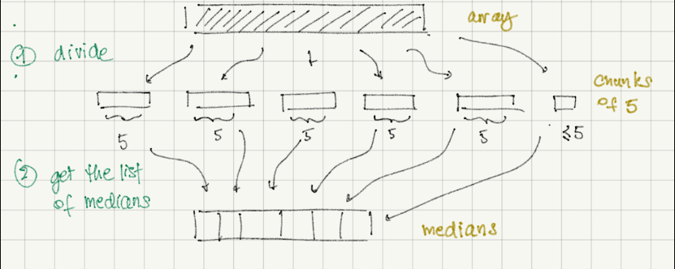
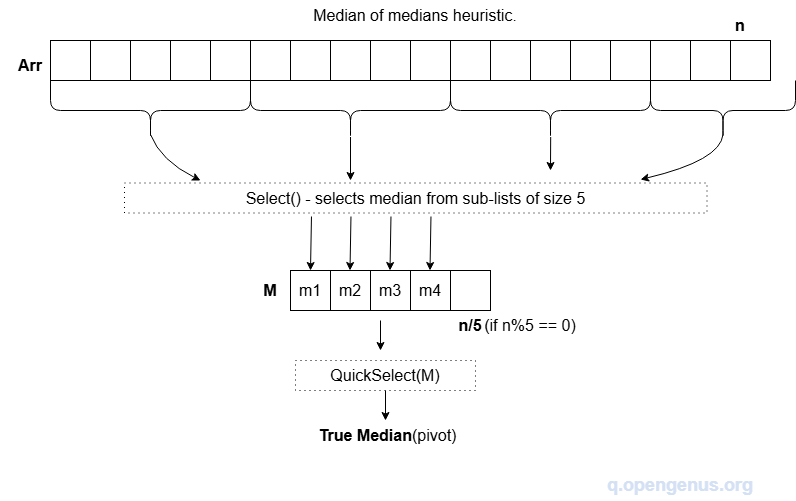
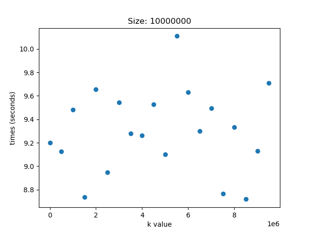
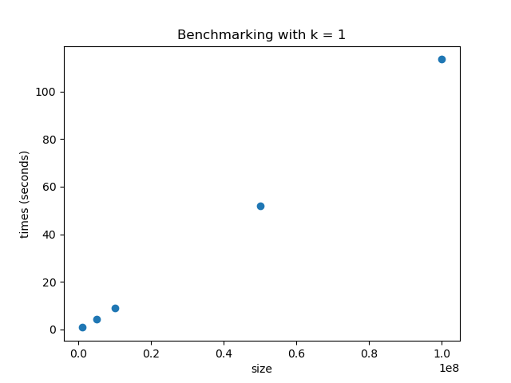
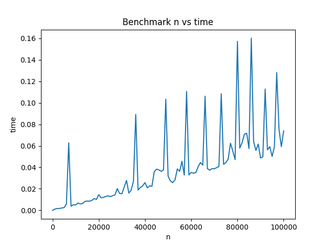
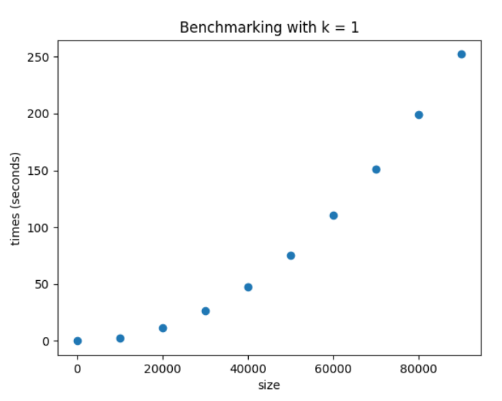
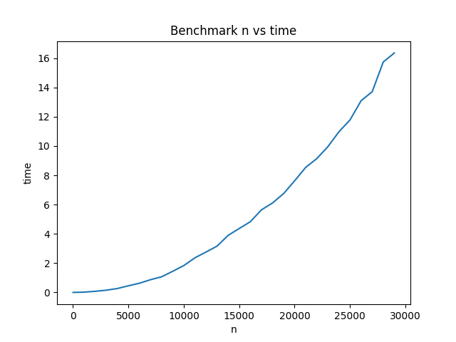

# Report
## Approach to solving the problem
The approach to the problem we took, was finding an efficient way to sort the input array so that we can then just take
the kth element. The algorithm we used is based off of the Median of Medians algorithm. This algorithm is a 
divide-and-conquer approach that finds the sorts an unsorted array in linear time, which we then can use to index with
the k element. This works off of dividing the list into sublists of 5 elements each, and then finding the median of each.
This median then is used as the pivot value to partition the array into three parts: elements less than the pivot, 
elements equal to the pivot, and elements greater than the pivot. This is done in O(n) time. From this the array containing
the kth element is chosen, based on where k is in relation to the pivot. This is done recursively and stops once the array is
of size 5, at which k is found by sorting. 

The median of medians pivot selection method was in the following article, which also contains a more in-depth explanation:
https://rcoh.me/posts/linear-time-median-finding/

### Illustration 1: 
  
This image illustrates the splitting of the array into sublists of 5 elements each. The median of each sublist is then taken, to a list of medians.

### Illustration 2:
  
This image illustrates the idea of taking the list of medians, and selecting based on those values.

## Pseudocode
```psuedocode
PROCEDURE SELECTION(A, k):
    RETURN SELECTION_RECURSIVE(A, k - 1)

PROCEDURE SELECTION_RECURSIVE(A, k):
    IF LENGTH(A) <= 5 THEN
        RETURN SORT(A)[k]
    END IF

    sublists ← EMPTY LIST
    FOR i FROM 0 TO LENGTH(A) - 1 STEP 5 DO
        sublist ← SUBARRAY(A, i, MIN(i + 5, LENGTH(A))) 
        sublists.APPEND(sublist)
    END FOR

    medians ← EMPTY LIST
    FOR EACH sublist IN sublists DO
        sorted_sublist ← SORT(sublist)
        median_index ← FLOOR(LENGTH(sorted_sublist) / 2)
        median_value ← sorted_sublist[median_index]
        APPEND median_value TO medians
    END FOR

    pivot ← SELECTION_RECURSIVE(medians, FLOOR(LENGTH(medians) / 2))

    (left, middle, right) ← PARTITION(A, pivot)

    IF k < LENGTH(left) THEN
        RETURN SELECTION_RECURSIVE(left, k)
    ELSE IF k < LENGTH(left) + LENGTH(middle) THEN
        RETURN middle[0]
    ELSE
        new_k ← k - LENGTH(left) - LENGTH(middle)
        RETURN SELECTION_RECURSIVE(right, new_k)
    END IF
END FUNCTION

PROCEDURE PARTITION(A, pivot):
    left ← EMPTY LIST
    middle ← EMPTY LIST
    right ← EMPTY LIST

    FOR EACH element IN A DO
        IF element < pivot THEN
            left.APPEND(element)
        ELSE IF element = pivot THEN
            middle.APPEND(element)
        ELSE IF element > pivot THEN
            right.APPEND(element)
        END IF
    END FOR

    RETURN (left, middle, right)
END FUNCTION
```

## Test cases
| Input                           | Expected Output | Actual Output |
|---------------------------------|-----------------|---------------|
| [1, 2, 3, 4, 5], k=1            | 1               | 1             |
| [1, 2, 3, 4, 5], k=3            | 3               | 3             |
| [1, 2, 3, 4, 5], k=5            | 5               | 5             |
| [5, 4, 3, 2, 1], k=1            | 1               | 1             |
| [5, 4, 3, 2, 1], k=3            | 3               | 3             |
| [5, 4, 3, 2, 1], k=5            | 5               | 5             |
| [2, 2, 2, 1, 1, 3, 3], k=1      | 1               | 1             |
| [2, 2, 2, 1, 1, 3, 3], k=5      | 2               | 2             |
| [2, 2, 2, 1, 1, 3, 3], k=7      | 3               | 3             |
| [7, 7, 7, 7, 7], k=1            | 7               | 7             |
| [7, 7, 7, 7, 7], k=3            | 7               | 7             |
| [7, 7, 7, 7, 7], k=5            | 7               | 7             |
| [42], k=1                       | 42              | 42            |
| [-10, 5, -3, 0, 8, -7, 12], k=1 | -10             | -10           |
| [-10, 5, -3, 0, 8, -7, 12], k=3 | -3              | -3            |
| [-10, 5, -3, 0, 8, -7, 12], k=7 | 12              | 12            |
| [10, 9, 8, 7, 6, 5], k=3        | 7               | 7             |
| [5, 4, 3, 2, 1], k=3            | 3               | 3             |
| [3, 2, 1], k=2                  | 2               | 2             |

## Justification of correctness
This algorithm solves this selection problem through recursion and maintance of the invariant. The 
invariant in this case is the medians. The first step is to divide the array into sublists of 5 
elements each. This is done to ensure that we can find the median of each sublist in O(1) time. This
allows us to take a median of medians, which will serve as the pivot point for the partitioning step.

Partitioning results in an 3 arrays: elements less than, equal to, and greater than the pivot. From
this the array that contains k is taken, based on its relation to the pivot, and the value of k is 
updated to reflect its original position in the new array.

Loop invariant: the current array contains k (the original element to be selected)
Base case: n < 5, where n = length of array, so the array can be sorted to find the kth element
Inductive step: The inductive step will use strong induction to prove the loop invariant. Assume
selection_recursive correctly partitions an array into a smaller one containing k, at any iteration i.
Then, at i + 1, the array containing k is partitioned using the median of medians as a pivot to create
3 arrays, containing elements less than, equal to, and greater than the pivot, respectively. From this, 
the array containing k is used for the next recursive step, which chosen by whether k is less than, 
equal to, or greater than the pivot. Thus, the new array contains k, so the loop invariant holds.
Termination: since the array is partitioned into smaller arrays each step, n <= 5 will be true at some point.

Thus, the algorithm correctly finds the kth element, as shown with the loop invariant and strong induction.

## Recurrence relation of run time
First, we have to analyze `PARTITION`. We can see that this function runs in $O(n)$ since we run through all elements `A`, which is length `n`.

Now, starting in `SELECTION_RECURSIVE`, we can see that we first split the list into sublists, which takes $O(n)$ as we are going through all of `A`.

Following that, the medians are calculated in $O(n)$ due to each sort taking place on at **most** 5 elements (since each sublist is), and therefore can be reduced to constant time. As we are sorting $n/5$ sublists, we get our $O(n)$.

We get to our first recursive call for choosing the pivot. This call with be a "conquer" step, where we get $T(n/5)$, since medians is at that length.

As stated above, `PARTITION` runs in $O(n)$, so we can keep going.

Finally, we get to a split of how the next and final recursive function is called. Considering this, we know that at least half of the medians are $\ge$ than the median of medians (which is what we are looking for). Therefore, half of the n/5 blocks have at least 3 elements $\ge$ median of medians, which gives us a split of 3n/10, with the other partition being the worst case of 7n/10.

As such, our final recurrence is:  
$T(n) = T(n/5) + T(7n/10) + O(n)$

## Solution to the recurrence relation
To solve this recurrence, we can employ a guess and check:  
Guess: $T(n)\in O(n)$  
So: $T(n) \le cn$  
Assume: $T(n/5) + T(7n/10)\le c\frac{n}{5} + c\frac{7n}{10}$  
Then:  
$T(n)\le c\frac{n}{5} + c\frac{7n}{10}\le cn$  
$\frac{9c}{10}\le c$, which is true for all $c >= 0$

Therefore, we have proven that $T(n) \in O(n)$

## Benchmarking results
Our benchmarking covers different values of n with the same k and different values of k with
the same n for our selection sort algorithm. All values in the array are randomly generated.
Moreover, the brute force solution of sorting the entire array and selecting the k-1th element
was also benchmarked, with different values of n and constant k. Since the k-1th element is 
being selected from a list, the value of k does not matter for this comparison. 

Below are the benchmarking results with the selection algorithm, using different values of k 
throughout a 10,000,000 size array:

 

The times stay consistently around 9-10 seconds despite the different values of k, so k
is not a variable in the asymptotic complexity.

---
Next, different values of n are benchmarked for the same k. The choice of k for these tests does
not matter, as shown by the previous results. The times increase linearly as sizes grow to higher
powers of 10, justifying the O(n) complexity.




---
Finally, the selection algorithm was compared to the brute force method of sorting the array and
selecting the k-1th element. Selection sort was used to sort the array, which has a time 
complexity of O(N²). 




---
These justifications are also confirmed by the following test statistics:  
```
For selection:
m1: 0.9425048358901872
p1: 1.3870105391189663e-15

For sorting:
m2: 1.6848129470664706
p2: 5.99574536886922e-47
```

The slopes, taken by `linregress()` by fitting the linear model to the logorithms of our benchmarks, we can see that `m1` shows that our SELECTION algorithms is at $O(n)$, while `m2` shows the brute forced selection sort at sub $O(n^2)$.


## Appendix
### Python code
```python
def selection(A : list, k : int):
    return selection_recursive(A, k - 1)

def selection_recursive(A : list, k : int):
    if len(A) <= 5:
        return sorted(A)[k]
    sublists = [A[i:i + 5] for i in range(0, len(A), 5)]
    medians = []
    for sublist in sublists:
        medians.append(sorted(sublist)[len(sublist) // 2])
    pivot = selection_recursive(medians, len(medians) // 2)

    left, middle, right = partition(A, pivot)
    if k < len(left):
        return selection_recursive(left, k)
    elif k < len(left) + len(middle):
        return middle[0]
    else: # k < len(left) + len(middle) + len(right)
        return selection_recursive(right, k - len(middle) - len(left))

def partition(A : list, pivot : int):
    left = []
    middle = []
    right = []
    for i in A:
        if i < pivot:
            left.append(i)
        if i == pivot:
            middle.append(i)
        if i > pivot:
            right.append(i)
    return (left, middle, right)
```

### Testing
```python
def main():
    # test cases
    numbers = [5, 1, 6, 7, 3, 4, 8]
    print(selection(numbers, 3)) # expecting 4

    numbers = [1, 2, 2, 2, 3, 4, 8, 6, 7, 3]
    s = selection(numbers, 10) # biggest, 8
    print(s)
    s = selection(numbers, 1) # smallest, 1
    print(s)
    s = selection(numbers, 5) # middle, 3
    print(s)

    numbers = [1, 2, 3, 4, 5, 6, 7, 8, 9, 10]
    s = selection(numbers, 10) # 10
    print(s)
    s = selection(numbers, 1) # 1
    print(s)
    s = selection(numbers, 5) # 5
    print(s)

    numbers = [10, 9, 8, 7, 6, 5, 4, 3, 2, 1]
    s = selection(numbers, 10) # 10
    print(s)
    s = selection(numbers, 1) # 1
    print(s)
    s = selection(numbers, 5) # 5
    print(s)

    numbers = [0, 0, 0, 0, 0, 0, 0, 0, 0, 0]
    s = selection(numbers, 10) # 0
    print(s)
    s = selection(numbers, 1) # 0
    print(s)
    s = selection(numbers, 5) # 0
    print(s)

    numbers = [0, 0, 0, 0, 1, 0, 0, 0, 0, 0]
    s = selection(numbers, 10)  # 1
    print(s)
    s = selection(numbers, 1)  # 0
    print(s)
    s = selection(numbers, 5)  # 0
    print(s)

    numbers = [2, 0, 1, 0, 2, 1]
    print(selection(numbers, 6)) # biggest, 2
    print(selection(numbers, 1))  # smallest, 0
    print(selection(numbers, 3))  # middle, 1


if __name__ == "__main__":
    main()

class SelectionTests(unittest.TestCase):

    def test_selection_with_small_sorted_array(self):
        array = [1, 2, 3, 4, 5]
        self.assertEqual(selection(array, 1), 1)
        self.assertEqual(selection(array, 3), 3)
        self.assertEqual(selection(array, 5), 5)

    def test_selection_with_small_reverse_sorted_array(self):
        array = [5, 4, 3, 2, 1]
        self.assertEqual(selection(array, 1), 1)
        self.assertEqual(selection(array, 3), 3)
        self.assertEqual(selection(array, 5), 5)

    def test_selection_with_duplicate_values(self):
        array = [2, 2, 2, 1, 1, 3, 3]
        self.assertEqual(selection(array, 1), 1)
        self.assertEqual(selection(array, 5), 2)
        self.assertEqual(selection(array, 7), 3)

    def test_selection_with_all_same_values(self):
        array = [7, 7, 7, 7, 7]
        self.assertEqual(selection(array, 1), 7)
        self.assertEqual(selection(array, 3), 7)
        self.assertEqual(selection(array, 5), 7)

    def test_selection_with_single_element(self):
        array = [42]
        self.assertEqual(selection(array, 1), 42)

    def test_selection_with_large_random_array(self):
        size = 1000
        array = [random.randint(-1000, 1000) for _ in range(size)]
        sorted_array = sorted(array)

        for k in [1, 10, size//2, size-10, size]:
            self.assertEqual(selection(array, k), sorted_array[k-1])

    def test_selection_recursive_directly(self):
        array = [5, 3, 1, 7, 9, 2, 6]
        self.assertEqual(selection_recursive(array, 0), 1)
        self.assertEqual(selection_recursive(array, 3), 5)
        self.assertEqual(selection_recursive(array, 6), 9)

    def test_partition_function(self):
        array = [5, 2, 8, 3, 5, 1, 7, 5]
        pivot = 5
        left, middle, right = partition(array, pivot)

        for item in left:
            self.assertLess(item, pivot)

        for item in middle:
            self.assertEqual(item, pivot)

        for item in right:
            self.assertGreater(item, pivot)

        self.assertEqual(len(left) + len(middle) + len(right), len(array))

    def test_empty_partition(self):
        array = []
        left, middle, right = partition(array, 5)
        self.assertEqual(left, [])
        self.assertEqual(middle, [])
        self.assertEqual(right, [])

    def test_partition_with_no_pivot_value_present(self):
        array = [1, 2, 3, 4, 6, 7]
        pivot = 5
        left, middle, right = partition(array, pivot)
        self.assertEqual(left, [1, 2, 3, 4])
        self.assertEqual(middle, [])
        self.assertEqual(right, [6, 7])

    def test_complex_scenario_with_negative_numbers(self):
        array = [-10, 5, -3, 0, 8, -7, 12]
        self.assertEqual(selection(array, 1), -10)
        self.assertEqual(selection(array, 3), -3)
        self.assertEqual(selection(array, 7), 12)

    def test_with_edge_case_group_sizes(self):
        array = [10, 9, 8, 7, 6, 5]
        self.assertEqual(selection(array, 3), 7)

        array = [5, 4, 3, 2, 1]
        self.assertEqual(selection(array, 3), 3)

        array = [3, 2, 1]
        self.assertEqual(selection(array, 2), 2)

def run_tests():
    suite = unittest.TestSuite()
    loader = unittest.TestLoader()
    suite.addTest(loader.loadTestsFromTestCase(SelectionTests))
    runner = unittest.TextTestRunner()
    result = runner.run(suite)
    return result

run_tests()
```

### Benchmarking
```python
import random
import time
import matplotlib.pyplot as plt

import Selection

def get_arrays(size, number):
    rand = random.Random()
    arrays = []
    for i in range(number):
        arr = []
        for j in range(size):
            arr.append(rand.random() * 1000)
        arrays.append(arr)
    return arrays

def select(A, k):
    return Selection.selection(A, k)

def benchmark(size, number, k):
    arrays = get_arrays(size, number)
    times = []
    for i in range(number):
        start_time = time.time()
        select(arrays[i], k)
        end_time = time.time()
        times.append(end_time - start_time)
    return times

def graph_times(results, size):
    ks = results.keys()
    times = results.values()
    plt.scatter(ks, times)
    plt.xlabel("k value")
    plt.ylabel("times (seconds)")
    plt.title("Size: " + str(size))
    savefig = str(len(ks)) + "k_results" + str(size) + ".png"
    plt.savefig(savefig)
    plt.close()

def benchmark_loop(size_range):
    number = 1 #number of arrays to make of each size
    for size in size_range:
        results = {}
        for k in [1, len(size)//2, len(size) - 1]:
            results.setdefault(k, benchmark(size, number, k))
        graph_times(results, size)
def main():

    sizes = [10_000_000
             ,50_000_000
             ,100_000_000
             ,200_000_000
             ,500_000_000
             ]
    sizes = [1_000_000
             ,5_000_000
             ,10_000_000
             ,50_000_000
             ,100_000_000
             ]
    benchmark_loop(sizes)

if __name__ == "__main__":
    main()
```
